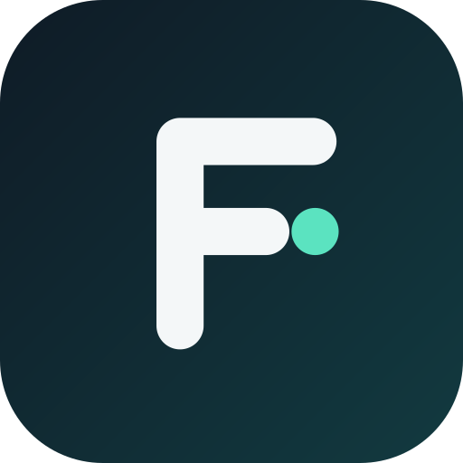

<p align="center">
  
</p>

<h1 align="center">FeldKit</h1>

<p align="center"><b>Open Mac and Windows drives on your Android phone. Free, open source, no root, no account.</b></p>

<p align="center">
APFS &middot; HFS+ &middot; NTFS &middot; exFAT &middot; FAT32 &middot; FileVault &middot; BitLocker
</p>

FeldKit is a field kit for people who work with drives: musicians, sound designers, photographers, videographers and
DITs, designers, animators, developers. When the laptop is not around, plug the SSD or card reader into your phone over
USB-C / OTG, see the files, play and preview them, check them, and copy them off (or on) with proof that nothing got
corrupted. No paid "drive reader" subscription needed.

## Does this solve your problem?

| You searched for | FeldKit |
|---|---|
| "Android can't read my Mac SSD / APFS drive" | reads APFS and HFS+, writes experimentally |
| "Android says drive is unsupported / needs formatting (NTFS)" | reads NTFS, writes experimentally |
| "open BitLocker drive on Android phone" | unlocks with password or 48-digit recovery key |
| "open FileVault encrypted external drive without a Mac" | unlocks with password or recovery key (read-only) |
| "copy footage from SSD to phone and verify the copy" | SHA-256 verified copy + `.sha256` manifest |
| "play ProRes / DNxHD / FLAC / AIFF from USB drive on Android" | built-in player with a libVLC fallback |
| "view RAW photos / PSD / EXIF from a card on my phone" | viewer with zoom and an EXIF panel |
| "unzip / unrar from an external drive on Android" | built-in archive browser and extractor |

## Screenshots

<!-- Screenshots are added once the interface is finished. See docs/screenshots/README.md -->
<p align="center"><i>Screenshots coming soon.</i></p>

## Origin

FeldKit is a fork of [VolumeX](https://github.com/FatalPuppet/VolumeX) by Mirko A. Calvi (FatalPuppet), MIT licensed.
The original author built the USB transport and the first APFS / HFS+ readers; if this app saves you money or a
deadline, consider thanking them. Details in [CREDITS.md](CREDITS.md).

---

## Filesystem support (verified on macOS-made images)

Every row below is checked by automated tests that build real disk images with the macOS tools
(`tools/make-fixtures.sh`), run the app's own mount/read/write code on them, and then let macOS
judge the result (`tools/verify-written.sh`: `fsck_apfs` / `fsck_hfs -f` / `fsck_exfat` / `fsck_msdos`,
mount, SHA-256 comparison).

| Format | Read | Write | Notes |
|--------|:----:|:-----:|-------|
| **exFAT** | yes | yes | NoFatChain files, 128 KB clusters, 8 GB volume tested |
| **FAT32** | yes | yes | long names, `~N` aliases, FSInfo |
| **HFS+ / HFS+J** | yes | yes | catalog B-tree split/merge, attribute cleanup on delete; refuses unclean/journal-pending volumes |
| **APFS** | yes | experimental | in-place editing (not copy-on-write); off by default (Settings > Experimental); needs an unencrypted volume with no snapshots; creates missing chunk bitmaps (verified with `fsck_apfs`, 150 MB file across chunks) |
| ext2/3/4 | yes | no | read-only |
| FileVault (APFS) | yes (password or recovery key) | no | verified against a volume encrypted by macOS (`filevault.img`, tests in `FileVaultTest`); opened read-only |
| NTFS | yes | experimental | MFT, attribute lists, sparse + compressed (LZNT1) files, large directories; verified on an image made by `mkntfs`/ntfs-3g (`tools/make-ntfs-fixture.sh`). Write (off by default): create / rename / delete with MFT growth and B+tree index splits, refuses dirty or hibernated volumes; verified with ntfs-3g and `ntfsresize` (`tools/verify-ntfs.sh`), **not** with Windows chkdsk. Not readable: EFS-encrypted files |
| BitLocker (Windows 7+, To Go) | yes (password or 48-digit recovery key) | no | XTS and CBC ciphers (not the Windows 7 diffuser mode); NTFS / exFAT / FAT32 inside; fixtures opened by cryptsetup and dislocker (`tools/make-bitlocker.py`) |
| LUKS / LVM | partial | no | unit-untested; treat as unverified |

Write operations: add files (streamed), new folder, rename, delete (recursive). Multi-partition GPT/MBR
drives are supported (EFI partition skipped).

### Known limits
- APFS write is in-place (no copy-on-write): an unplugged cable mid-write can leave the volume needing `fsck_apfs`. Encrypted and snapshotted volumes stay read-only.
- HFS+ write does not grow the catalog file and cannot delete files whose attributes or extents live in overflow structures.
- 4Kn (4096-byte logical sector) drives are not supported; sector size is assumed to be 512.
- A power loss while an APFS write is in progress can leave the drive needing repair on a Mac.

### Test it yourself
```
tools/make-fixtures.sh          # builds app/build/fixtures/*.img with macOS tools
./gradlew :app:testDebugUnitTest
tools/verify-written.sh         # asks macOS (fsck + mount + hashes) about every written image
tools/phone-image.sh push|open|import|pull   # run the debug app on a phone against an image
```

---

## Architecture

```
app/
├── provider/
│   ├── DriveFileProvider        # ContentProvider pipe-streams files ("Open With" / Share)
│   └── DriveDocumentsProvider   # DocumentsProvider (Android file picker integration)
├── security/
│   └── KeystorePasswordManager  # AES-GCM + Android Keystore + BiometricPrompt
├── services/
│   └── TransferService          # Foreground Service for non-blocking transfers
├── storage/
│   ├── ActiveDriveSession       # Singleton for active reader (used by ContentProviders)
│   ├── FileOperationManager     # copy / delete / mkdir with progress callbacks
│   ├── crypto/
│   │   ├── AesXts               # Manual AES-XTS (GF(2^128) tweak advance)
│   │   ├── ApfsKeyDerivation    # PBKDF2-HMAC-SHA256 KEK, base-32 recovery key decode
│   │   ├── ApfsKeybag           # TLV keybag parser + RFC 3394 AES key unwrap
│   │   └── ApfsCrypto           # FileVault keybag / PBKDF2 / key unwrap
│   ├── disk/                    # BlockDeviceReader, DiskScanner, Partition
│   ├── filesystem/
│   │   ├── apfs/                # APFS container/volume superblock, OMAP, B-tree, reader
│   │   ├── hfsplus/             # HFS+ volume header, catalog B-tree, reader
│   │   ├── fat32/               # FAT32 boot sector, cluster chain, LFN reader
│   │   ├── ext/                 # ext2/3/4 superblock, BGD, extent tree reader
│   │   ├── exfat/               # exFAT boot sector
│   │   └── partition/           # GPT + MBR partition table parsers
│   ├── scsi/                    # SCSI command set (INQUIRY, READ CAPACITY, READ 10)
│   └── usb/                     # USB Bulk-Only Transport, UAS transport, interface scanner
└── ui/
    ├── screens/
    │   ├── HomeScreen            # USB connect flow, device info
    │   ├── VolumePickerScreen    # Multi-partition volume selector
    │   ├── FileBrowserScreen     # Directory listing, search, grid/list, operations
    │   ├── FilePreviewScreen     # Image / audio / video preview
    │   ├── FileVaultUnlockScreen # Password / recovery key entry
    │   ├── TransferScreen        # Transfer queue and progress
    │   └── SettingsScreen        # Hidden files, view mode, saved passwords
    ├── components/               # GlassCard, FileListItem, DeviceVolumeCard, ...
    └── theme/                    # Liquid Glass palette (deep navy + frosted glass)
```

---

## Requirements

- Android 8.0 (API 26) or newer with USB OTG support
- USB-C cable or USB-OTG adapter; large bus-powered drives may need a powered hub
- No root, no Mac, no account required

## Credits
See [CREDITS.md](CREDITS.md).

## License

See [LICENSE](LICENSE).
